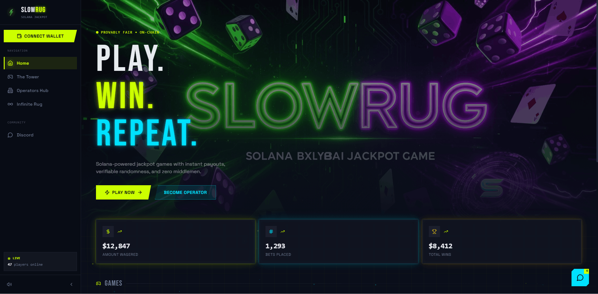
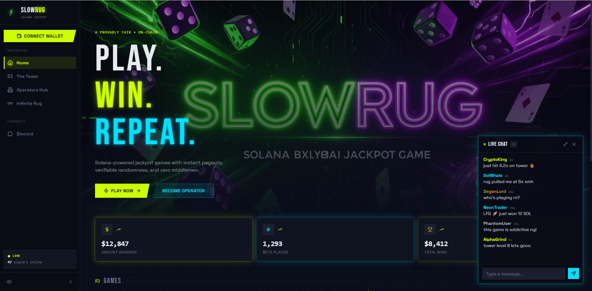
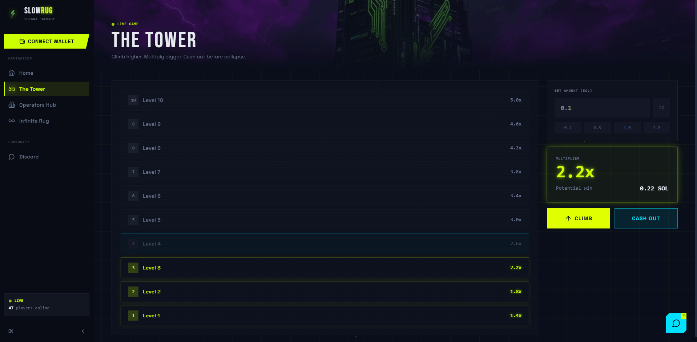
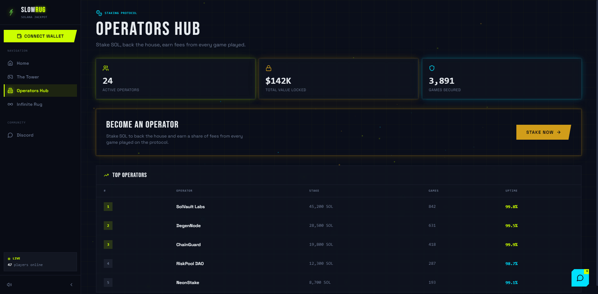
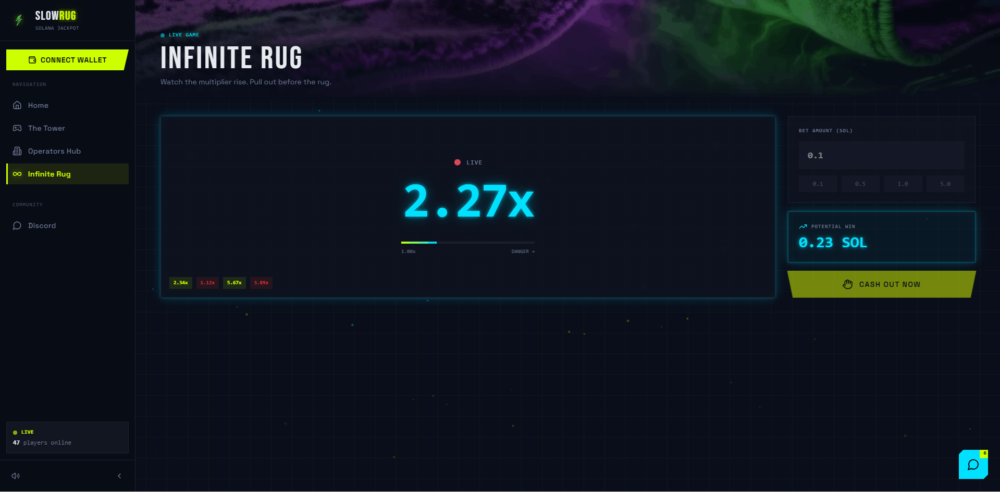

# 🎰 SlowRug — Solana Jackpot (Frontend)

A neon-soaked **Solana jackpot** web experience: cyberpunk UI, particle effects, live chat chrome, and multiple game surfaces — built as a fast **Vite + React** single-page app.

> 🌐 **UI-first** — polished visuals and flows; chain logic / real wallets can be wired in later.

[](https://t.me/TopTrenDev_66)
[](https://x.com/intent/follow?screen_name=toptrendev)

---

## ✨ Highlights

- 🎨 **Cyberpunk design system** — neon lime, cyan, gold, and chrome; glows, scanlines, gradient borders
- 🗺️ **Multi-page routing** — Home, Tower, Infinite Rug, Operators hub (`react-router-dom`)
- 🎨 **Tailwind CSS** — custom UI with semantic theme tokens and **lucide-react** icons
- 🧪 **Vitest** for unit tests

---

## 📸 Screenshots

### Home





### The Tower



### Operators Hub



### Infinite Rug



---

## 🚀 Quick start

```bash
cd slowrug-solana-jackpot-frontend
npm install
npm run dev
```

Clone or download the repo first if you do not already have this folder locally.

Open **http://localhost:8080** — the dev server is configured for that port.

---

## 📜 Scripts

| Command | Description |
|--------|-------------|
| `npm run dev` | Start Vite dev server (port **8080**) |
| `npm run build` | Production build → `dist/` |
| `npm run build:dev` | Build with `development` mode |
| `npm run preview` | Serve the production build locally |
| `npm run lint` | Run ESLint |
| `npm run test` | Run Vitest once |
| `npm run test:watch` | Vitest in watch mode |

---

## 🛣️ Routes

| Path | Page |
|------|------|
| `/` | Home |
| `/tower` | Tower |
| `/infinite-rug` | Infinite Rug |
| `/operators` | Operators |
| `*` | Not found |

---

## 🧰 Tech stack

- **React 18** + **TypeScript**
- **Vite 5** + `@vitejs/plugin-react-swc`
- **Tailwind CSS** + **tailwindcss-animate**
- **lucide-react** icons
- **Vitest**

---

## 📁 Project layout (overview)

```
src/
├── components/     # Layout, chat, effects
├── pages/          # Route screens
├── hooks/          # Shared hooks (e.g. wallet)
├── lib/            # Utilities
├── assets/         # Images & static art
├── App.tsx         # Router
└── main.tsx        # Entry
public/             # Favicon, screenshots & public assets
```

---

## 🖼️ Fonts & styling

Google Fonts (**Bebas Neue**, **Space Grotesk**, **IBM Plex Mono**) are loaded from `src/index.css`. Theme tokens live in CSS variables under `@layer base` — prefer semantic classes (`bg-card`, `text-primary`, etc.) over raw `hsl(...)` in components.

---

## 🏗️ Production build

```bash
npm run build
npm run preview
```

Deploy the `dist/` folder to any static host (CDN, Vercel, Netlify, S3, etc.). Set your host’s SPA fallback to `index.html` so client-side routes work.
